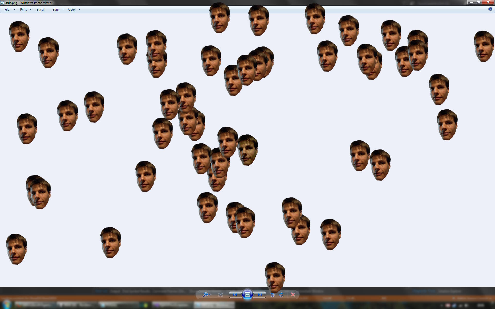
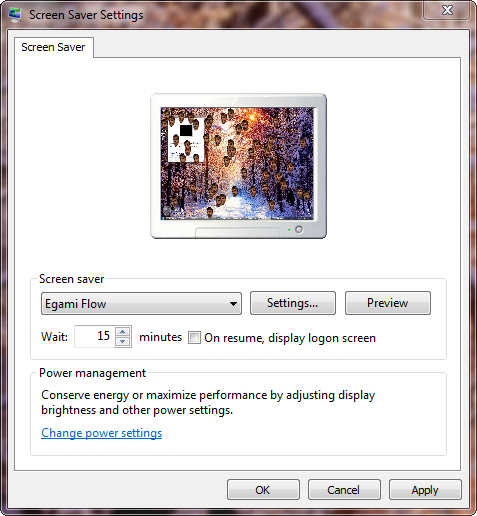
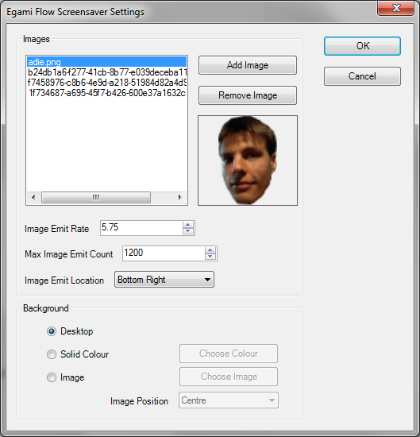

# Egami Flow Screensaver
[![GitHub tag][GitHubTagImage]][GitHubTagUrl]
[![AppVeyor master][AppVeyorImage]][AppVeyorUrl]
[![license][LicenceImage]][LicenceUrl]

A Windows screensaver allowing custom images to float around the desktop.

[GitHubTagImage]: https://img.shields.io/github/tag/natsnudasoft/EgamiFlowScreensaver.svg?maxAge=300&style=flat-square
[GitHubTagUrl]: https://github.com/natsnudasoft/EgamiFlowScreensaver
[AppVeyorImage]: https://img.shields.io/appveyor/ci/natsnudasoft/EgamiFlowScreensaver/master.svg?maxAge=300&style=flat-square
[AppVeyorUrl]:  https://ci.appveyor.com/project/natsnudasoft/EgamiFlowScreensaver/branch/master
[LicenceImage]: https://img.shields.io/github/license/natsnudasoft/EgamiFlowScreensaver.svg?maxAge=2592000&style=flat-square
[LicenceUrl]: http://www.apache.org/licenses/LICENSE-2.0

## Installation

Download *EgamiFlowScreensaver_Release_Any_CPU.zip* from the latest release found [here](https://github.com/natsnudasoft/EgamiFlowScreensaver/releases/latest).
Extract the contents of the zip file, and navigate to the *EgamiFlowScreensaver* folder and run
*Egami Flow Screensaver.exe* to install the screensaver. You should now be able to select the
screensaver from the Windows screensaver settings window.

## Configuration

You can configure the screensaver by clicking the *Settings...* button on the Windows screensaver
settings window. The configuration window looks like the image below.

On this page you can manage the images that will be randomly selected to float around the screen by
the screensaver while it is running, as well as configure a few other settings as follows:

### Images Settings
#### Image Emit Rate
The number of new images that will be created by the screensaver per second.

#### Max Image Emit Count
The maximum number of images that will be created by the screensaver; when this number of images
are floating around the screen, the screensaver will stop creating new images.

### Background Settings
#### Desktop
The screensaver will take a screenshot of the current desktop and use that as the background.

#### Solid Color
The screensaver will display a chosen colour as the background.

#### Image
The screensaver will display a chosen image as the background.