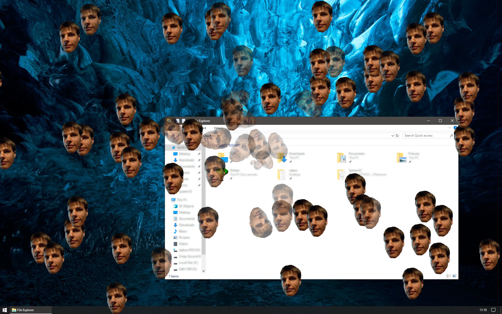
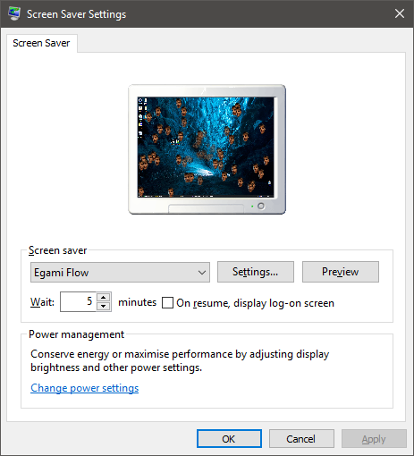

# Egami Flow Screensaver
[![GitHub tag][GitHubTagImage]][GitHubTagUrl]
[![AppVeyor master][AppVeyorImage]][AppVeyorUrl]
[![license][LicenceImage]][LicenceUrl]

A configurable Windows screensaver allowing user specified images to float around the desktop.
Multiple images may be specified and the screensaver will select from these images at random.

See the [configuration](#configuration) section for more details on the available features.

## Installation

Download *EgamiFlowScreensaver_Release_Any_CPU.zip* from the latest release found [here](https://github.com/natsnudasoft/EgamiFlowScreensaver/releases/latest).
Extract the contents of the zip file, and navigate to the *EgamiFlowScreensaver* folder and run
*Egami Flow Screensaver.exe* to install the screensaver. You should now be able to select the
screensaver from the Windows screensaver settings window.

## Configuration

You can configure the screensaver by clicking the *Settings...* button on the Windows screensaver
settings window. The configuration window looks like the image below.

On this page you can manage the images that will be randomly selected to float around the screen by
the screensaver while it is running, as well as configure a few other settings as follows:

### Images Settings
#### Image Emit Rate
The number of new images that will be created by the screensaver per second.

#### Max Image Emit Count
The maximum number of images that will be created by the screensaver; when this number of images
are floating around the screen, the screensaver will stop creating new images.

#### Image Emit Location
The location that images will be emitted at on the screensaver; possible values are described
in the following table:

| Value          | Description                                                                                                                             |
| -------------- | --------------------------------------------------------------------------------------------------------------------------------------- |
| Random Corner  | Images should be emitted from a random corner of the primary screen. The corner will be randomly chosen each time an image is emitted.  |
| Bottom Left    | Images should be emitted from the bottom left of the primary screen.                                                                    |
| Top Left       | Images should be emitted from the top left of the primary screen.                                                                       |
| Top Right      | Images should be emitted from the top right of the primary screen.                                                                      |
| Bottom Right   | Images should be emitted from the bottom right of the primary screen.                                                                   |
| Centre         | Images should be emitted from the centre of the primary screen.                                                                         |
| Random         | Images should be emitted from random locations on the primary screen.                                                                   |

### Background Settings
#### Desktop
The screensaver will take a screenshot of the current desktop and use that as the background.

#### Solid Color
The screensaver will display a chosen colour as the background.

#### Image
The screensaver will display a chosen image as the background.

##### Image Position
How the screensaver will position the chosen background image; possible values are described
in the following table:

| Value   | Description                                                                                                                                                        |
| ------- | ------------------------------------------------------------------------------------------------------------------------------------------------------------------ |
| Centre  | The image will remain centred at its original size.                                                                                                                |
| Fill    | The image will scale up or down to the minimum possible size required to fill the entire background, maintaining the images original aspect ratio.                 |
| Fit     | The image will scale up or down to the maximum possible size required to display the entire image on the background, maintaining the images original aspect ratio. |
| Stretch | The image will scale to the same size as the background area, ignoring the images original aspect ratio.                                                           |
| Tile    | The image will be repeated across the screen at its original size.                                                                                                 |

[GitHubTagImage]: https://img.shields.io/github/tag/natsnudasoft/EgamiFlowScreensaver.svg?maxAge=300&style=flat-square
[GitHubTagUrl]: https://github.com/natsnudasoft/EgamiFlowScreensaver
[AppVeyorImage]: https://img.shields.io/appveyor/ci/natsnudasoft/EgamiFlowScreensaver/master.svg?maxAge=300&style=flat-square
[AppVeyorUrl]:  https://ci.appveyor.com/project/natsnudasoft/EgamiFlowScreensaver/branch/master
[LicenceImage]: https://img.shields.io/github/license/natsnudasoft/EgamiFlowScreensaver.svg?maxAge=2592000&style=flat-square
[LicenceUrl]: http://www.apache.org/licenses/LICENSE-2.0